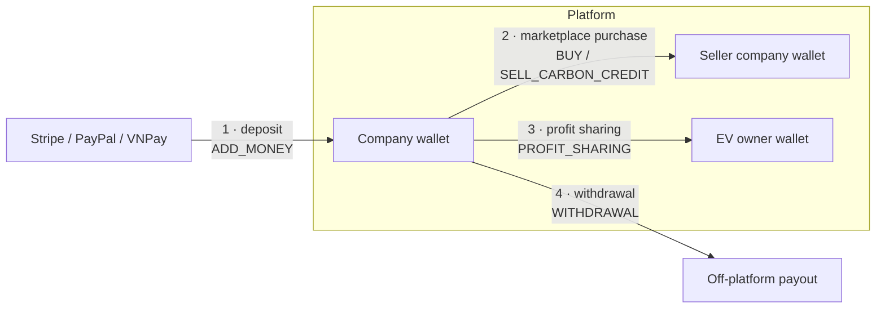
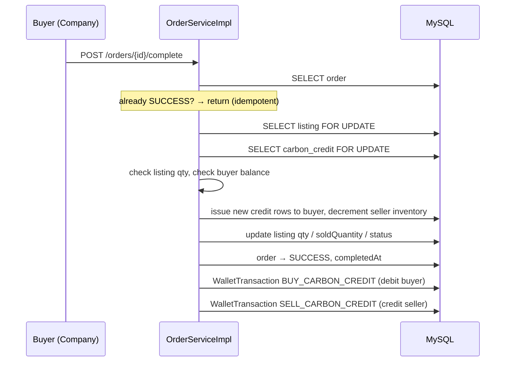

# CarbonX — Carbon Credit Marketplace

A carbon-credit exchange where EV owners earn credits from verified driving data, companies buy and
retire those credits, and a third-party verifier (CVA) signs off on the emission reports that create
them. Every one of those steps moves money or credits between wallets, so the backend is built
around a single idea: **no balance changes without an immutable ledger row that records the balance
before and after.**

Spring Boot 3.3 / Java 17 / MySQL 8 / Redis · React 18 + Vite · Docker Compose + Nginx

<p align="left">
  
  
  
  
  
</p>

---

## 1. Actors and what each one can move

| Actor | Owns | Can move |
|---|---|---|
| **EV Owner** | a wallet (cash + credit balance), vehicles | receives profit-sharing payouts |
| **Company** | a wallet, credit inventory, marketplace listings | buys/sells credits, retires credits, pays out to EV owners |
| **CVA** (verifier) | nothing financial | approves emission reports → unlocks credit issuance |
| **Admin** | — | approves withdrawals, oversees users and finance |

Two independent balances live on the same `wallets` row:

- `balance` — cash, `DECIMAL(18,2)`
- `carbon_credit_balance` — credits, `DECIMAL(18,4)`

Both are only ever mutated together with a `WalletTransaction` insert (see §3).

---

## 2. The four money flows

Everything financial in this system is one of four flows. All four converge on `WalletTransaction`.



### Flow 1 — Deposit (gateway → wallet)

`POST /api/v1/payment` creates a `PaymentOrder(PENDING)` and returns a gateway checkout URL
(Stripe Session / PayPal approval link / VNPay redirect). After the user pays, the return URL calls
`POST /api/v1/wallet/deposit?order_id&payment_id`, which:

1. Loads the `PaymentOrder` **with a pessimistic lock** (`findByIdWithLock`) and short-circuits if it
   is already `SUCCEEDED` — this is the idempotency guard against a replayed return URL.
2. Marks the order `SUCCEEDED`.
3. Calls `WalletService.addBalanceToWallet`, which delegates to
   `WalletTransactionService.createTransaction(ADD_MONEY)` — the only code path allowed to touch
   `wallet.balance`.

`PaymentServiceImpl` → `WalletServiceImpl` → `WalletTransactionServiceImpl`. Note that step 3 is what
actually credits the wallet: `processPaymentOrder` only settles the `PaymentOrder` and never touches
a balance itself.

### Flow 2 — Marketplace purchase (buyer wallet → seller wallet)

`POST /api/v1/orders` creates an `Order(PENDING)` after checking listing availability, quantity, and
that the buyer is not the seller. Settlement is a separate, explicit step —
`POST /api/v1/orders/{id}/complete`:



The two hot rows — the listing and the seller's `CarbonCredit` inventory — are taken with
`PESSIMISTIC_WRITE` (`SELECT … FOR UPDATE`) *before* any balance is read, so two buyers racing for
the last credit on a listing serialise instead of overselling. The whole method is one
`@Transactional`; a failure anywhere marks the order `ERROR` and rolls the money back.

### Flow 3 — Profit sharing (company wallet → many EV owner wallets)

Triggered by `POST /api/v1/profit-sharing/share` once a CVA has verified the emission reports.
`ProfitSharingServiceImpl` computes, per EV owner, the energy they contributed → credits (emission
factor 0.6) → cash payout, then pays each owner in **its own `REQUIRES_NEW` transaction**:

- One owner's failure (missing wallet, insufficient company balance) is recorded as a
  `ProfitDistributionDetail(FAILED)` with the error message and does **not** roll back the owners
  already paid.
- The transfer itself goes through `WalletService.transferFunds`, which locks *both* wallets with
  `PESSIMISTIC_WRITE` before reading either balance — the classic two-account transfer, with the
  debit and the credit written as two linked `WalletTransaction` rows (negative and positive amount)
  pointing at the same `ProfitDistribution`.
- Email failures are caught and logged; they never roll back a completed transfer.

### Flow 4 — Withdrawal (wallet → off-platform, admin-gated)

`POST /api/v1/withdrawal/{amount}` checks the balance and creates a `Withdrawal(PENDING)`. An admin
then calls `PATCH /api/v1/withdrawal/admin/{id}/process/{accept}`, which either marks it `SUCCEEDED`
or `REJECTED` and returns the amount to the wallet. Both outcomes notify the user by email and over
SSE.

---

## 3. The ledger: why `balanceBefore` / `balanceAfter`

`WalletTransaction` is append-only and stores, on every row:

| Column | Why it exists |
|---|---|
| `amount` | the delta (negative for debits in `transferFunds`) |
| `balance_before`, `balance_after` | the wallet's balance immediately either side of *this* row |
| `transaction_type` | `ADD_MONEY`, `BUY_CARBON_CREDIT`, `SELL_CARBON_CREDIT`, `PROFIT_SHARING`, `WITHDRAWAL`, `ISSUE_CREDIT`, `RETIRE_CREDIT`, … |
| `order_id`, `payment_order_id`, `credit_batch_id`, `distribution_id` | the business event that caused it — every row traces back to something |
| `created_at` | `@CreationTimestamp`, never set by hand |

Storing the two balances is redundant with `SUM(amount)` — and that redundancy **is the point**:

1. **Reconciliation without replay.** `wallet.balance` can be checked against the newest row's
   `balance_after` in one query. If they disagree, something wrote a balance outside the ledger, and
   you know it immediately instead of during an audit.
2. **The chain localises gaps.** The intent is that each row's `balance_before` continues the previous
   row's `balance_after`, so a break in that chain points at a specific pair of transactions instead
   of leaving you to diff a whole wallet.
3. **Statements stay correct after policy changes.** A statement line shows the balance the user
   actually had at that moment, not one recomputed under today's rules.

This is the standard trade in banking ledgers: give up normalisation to get an audit trail you can
check with a query. The cost is that the two columns must be written by the *same* code that mutates
the balance — which is why `WalletTransactionServiceImpl.createTransaction` and
`WalletServiceImpl.transferFunds` are the only two places allowed to do it.

Credit movements use the same mechanism against `carbon_credit_balance` (`ISSUE_CREDIT` on issuance,
`RETIRE_CREDIT` on retirement), so the credit side is auditable the same way the cash side is.

---

## 4. Why SSE for notifications

Users need to hear about events they did not trigger: a deposit clearing, an order settling, a
withdrawal being approved, a payout landing. Three options:

| | Polling | WebSocket | **SSE** |
|---|---|---|---|
| Direction needed | — | bidirectional | **server → client only** ✔ |
| Latency | poll interval | instant | instant |
| Infra cost | N clients × interval requests | new protocol, upgrade path through Nginx | plain HTTP/1.1 `text/event-stream` |
| Auth | existing JWT filter | needs a separate handshake auth path | **existing JWT filter, unchanged** ✔ |
| Reconnect | n/a | hand-rolled | built into `EventSource` |

Every notification in this system is one-directional — the client never pushes anything back over the
channel, it uses normal REST for that. Paying for WebSocket's bidirectionality would mean a second
authentication path and a proxy upgrade config for capability we don't use. SSE rides the existing
`Authorization` header through the same Spring Security filter chain.

Implementation (`SseServiceImpl`): `GET /api/v1/notifications` returns an `SseEmitter` with a 30-minute
timeout, held in a `ConcurrentHashMap<Long, SseEmitter>` keyed by user id. `onCompletion` /
`onTimeout` / `onError` all remove the entry, and a new subscription for the same user completes the
previous emitter so a reconnect cannot leak the old one.

The registry is per-JVM, which fits the current single-instance deployment. Scaling out horizontally
would move it behind Redis pub/sub so any node can reach any connected user.

---

## 5. Architecture

```
Controller  ──►  Service (interface)  ──►  ServiceImpl  ──►  Repository (Spring Data JPA)
    │                                           │
    │ ApiRequest<T> / ApiResponse<T>             │ @Transactional boundary lives here
    │ (utils/common)                             │ pessimistic locks declared on repo methods
    ▼
GlobalExceptionHandler (@ControllerAdvice)
```

Package layout under `com.carbonx.marketcarbon`:

| Package | Contents |
|---|---|
| `controller/` | REST endpoints, one per aggregate; no business logic |
| `service/` + `service/impl/` | interface + implementation; **transaction boundaries** |
| `repository/` | Spring Data JPA, including explicit `@Lock(PESSIMISTIC_WRITE)` finders |
| `model/` | JPA entities |
| `dto/request`, `dto/response` | wire types, never entities |
| `mapper/` | MapStruct entity ↔ DTO |
| `utils/common/` | `ApiRequest<T>`, `ApiResponse<T>`, `ResponseStatus` — the API envelope |
| `exception/` | `AppException` + `ErrorCode` enum + `GlobalExceptionHandler` |
| `helper/notification/`, `scheduler/`, `config/` | email templating, cron jobs, security/Redis/S3 config |

### API envelope

Every request and response is wrapped, so a trace id survives the whole round trip:

```jsonc
// request
{ "requestTrace": "uuid", "requestDateTime": "2026-08-20T09:00:00Z", "data": { /* payload */ } }

// response
{ "requestTrace": "uuid", "requestDateTime": "...",
  "responseStatus": { "responseCode": "200", "responseMessage": "SUCCESS" },
  "response": { /* payload */ } }
```

`ApiRequest` accepts `requestParameters` / `requestParamters` as `@JsonAlias` for `data` — legacy
clients from before the field was renamed. Callers may supply `X-Request-Trace` and
`X-Request-DateTime` headers; controllers generate a UUID when they don't.

### Security

JWT access/refresh via `jjwt`, Google OAuth2 login, email OTP verification, role-based access
(`ADMIN` / `COMPANY` / `EV_OWNER` / `CVA`), and a token-bucket rate limiter
(`app.rate-limit.capacity=20` per minute).

---

## 6. Running locally

**Docker Compose (everything, recommended):**

```bash
docker compose up --build -d
# MySQL      localhost:3307   (db core_ccm)
# backend    localhost:8082
# frontend   localhost:3000
```

**Backend on the host, MySQL in Docker:**

```bash
docker compose up -d db
cd backend/Market_carbon
export SPRING_PROFILES_ACTIVE=local
./mvnw spring-boot:run
```

Config is entirely environment-driven — `application.properties` contains only `${VAR}` placeholders,
no defaults for secrets. The minimum to boot:

```bash
SPRING_DATASOURCE_URL=jdbc:mysql://localhost:3307/core_ccm?useSSL=false&allowPublicKeyRetrieval=true&serverTimezone=UTC
SPRING_DATASOURCE_USERNAME=root
SPRING_DATASOURCE_PASSWORD=12345
SPRING_DATASOURCE_DRIVER_CLASS_NAME=com.mysql.cj.jdbc.Driver
SERVER_PORT=8082
SPRING_MAIL_HOST=smtp.gmail.com
SPRING_MAIL_PORT=587
SPRING_MAIL_USERNAME=...
SPRING_MAIL_PASSWORD=...
SPRING_MAIL_PROPERTIES_MAIL_SMTP_AUTH=true
SPRING_MAIL_PROPERTIES_MAIL_SMTP_STARTTLS_ENABLE=true
```

Optional integrations degrade rather than fail to start: `STRIPE_API_KEY`, `PAYPAL_CLIENT_ID` /
`PAYPAL_CLIENT_SECRET` / `PAYPAL_MODE`, `AWS_S3_BUCKET` + credentials, `AI_VERTEX_*` /
`AI_GEMINI_*` for the AI scoring and chatbot.

Schema is managed by `spring.jpa.hibernate.ddl-auto=update`, so the first boot against an empty
`core_ccm` database creates the tables.

`DataInitializer` then seeds the roles and the three demo accounts. Their credentials are
overridable — `carbonx.seed.admin-email` / `-password`, and the same pair for `company-` and `cva-`.
Left unset, they fall back to the development defaults and the app logs a warning naming each
account still using one.

**Frontend:**

```bash
cd frontend && npm install && npm run dev
```

**Tests:**

```bash
cd backend/Market_carbon && ./mvnw test
```

---

## Demo accounts

| Role | URL | Email | Password |
|---|---|---|---|
| Admin | https://carbonx.io.vn/admin/carbonX/mkp/login | admin1@gmail.com | `Tuong2005@` |
| Company | https://carbonx.io.vn/login | company@example.com | `Password@1` |
| CVA | https://carbonx.io.vn/cva/carbonX/mkp/login | cva@example.com | `Password@1` |

> Demo data is reset periodically; these accounts are for evaluation only.

Full functional documentation:
[Google Drive](https://drive.google.com/drive/u/1/folders/1V0FyoZw_b9KMyj4aiCg9Z2sy7t4khyE-)

---

## Team — AQHighTeam

| Student ID | Name | GitHub |
|---|---|---|
| SE196732 | Nguyễn Gia Khiêm | https://github.com/giakhiem20051710 |
| SE196853 | Lê Huy Tường | https://github.com/LeHuyTuong |
| SE196587 | Phan Bảo Tín | https://github.com/linh20051708 |
| SE193952 | Phạm Thị Diệu Linh | https://github.com/PhanBaoTin |

Academic submission; external contributions are not accepted.
