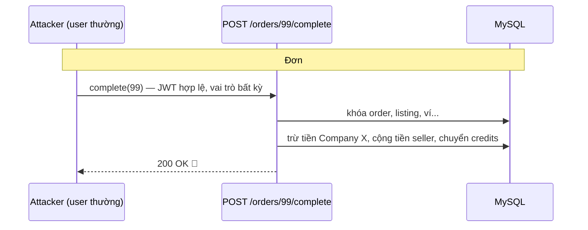
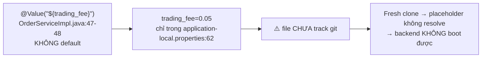
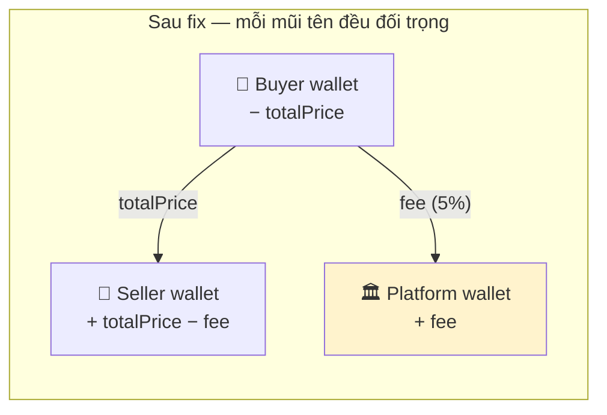
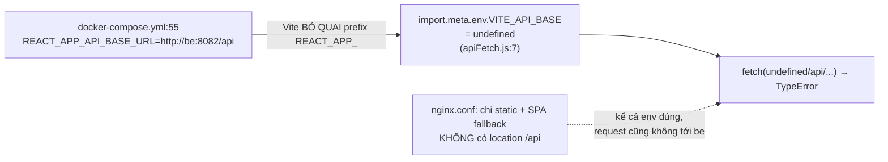

# 02 — PLAN P0: 4 fix sống còn (làm tuần này)

> Mỗi fix: 🔴 triệu chứng → 🔬 nguyên nhân (kèm code hiện tại) → 🛠️ các bước sửa (code AFTER)
> → 🧪 test viết trước → ✅ tiêu chí nghiệm thu. Bài học nền tảng nằm ở [`05_LESSONS_LEARNED.md`](05_LESSONS_LEARNED.md).

---

## §1 · FIX-P0-1 — Chặn hoàn tất đơn của người khác

### 🔴 Triệu chứng
Bất kỳ user nào đã đăng nhập (EV_OWNER, CVA...) gọi `POST /api/v1/orders/{id}/complete` với id đơn
của công ty khác là **settle được**: tiền bị ghi nợ khỏi ví người mua thật, credit chuyển thật.

### 🔬 Nguyên nhân
`backend/.../controller/OrderController.java:51-57`:

```java
@Operation(summary = "System complete a PENDING Order", ...)
@PostMapping("/{id}/complete")          // ← KHÔNG có @PreAuthorize, KHÔNG kiểm ownership
public ResponseEntity<ApiResponse<MessageResponse>> completeOrder(...)
```

So sánh: `createOrder` ngay trên đó **có** `@PreAuthorize("hasRole('COMPANY')")` (dòng 34).
Trong service, `completeOrder(Long orderId)` (`OrderServiceImpl.java:187`) không hề biết *ai* đang gọi —
email principal chỉ được dùng làm chuỗi trang trí `issuedBy` (dòng ~284).



⚠️ **Bẫy đặt tên cần biết khi fix:** trong builder (`OrderServiceImpl.java:110`) thì
`.company(buyerCompany)` — tức field `order.company` đang chứa **NGƯỜI MUA**.
Seller phải lấy qua `listing.getCarbonCredit().getCompany()`. Kiểm tra lại getter thật khi code,
đừng tin tên field.

### 🛠️ Sửa (2 lớp phòng)

**Lớp 1 — controller:** giới hạn role (vẫn chưa đủ):

```java
@PostMapping("/{id}/complete")
@PreAuthorize("hasAnyRole('COMPANY','ADMIN')")   // lớp 1: ai đủ tư cách gọi
```

**Lớp 2 — service (quan trọng hơn):** ownership check bên trong, ngay sau khi load order:

```java
// OrderServiceImpl.completeOrder(...) — sau khi có order, TRƯỚC mọi thay đổi trạng thái:
Company caller = companyRepository.findByUser_Email(currentUsername())   // xem note dưới
        .orElseThrow(() -> new AppException(ErrorCode.UNAUTHORIZED));

Long buyerId  = order.getCompany().getId();                              // ⚠️ company == BUYER (xem bẫy tên)
Long sellerId = order.getMarketplaceListing().getCarbonCredit()
                    .getCompany().getId();

boolean isParty = caller.getId().equals(buyerId) || caller.getId().equals(sellerId);
if (!isParty && !caller.getUsers().stream().anyMatch(u -> hasRoleAdmin(u))) {
    log.warn("FIX-P0-1: user {} attempted to complete foreign order {}", currentUsername(), orderId);
    throw new AppException(ErrorCode.UNAUTHORIZED);   // chọn ErrorCode phù hợp sẵn có
}
```

- Nếu dự án đã có helper "currentUser" ở service khác (KYC/Marketplace dùng rồi) — **tái sử dụng**, đừng viết mới.
- Chính sách nghiệp vụ: cho phép **một trong hai bên** (buyer hoặc seller) kích hoạt settle; ADMIN cũng được. Nếu nghiệp vụ chỉ cho seller xác nhận giao dịch thì siết lại 1 dòng.

### 🧪 Test viết trước (`OrderCompleteAuthorizationTest` — Mockito, sẽ đỏ)

1. `evOwner_callingComplete_throwsUnauthorized`
2. `unrelatedCompany_callingComplete_throwsUnauthorized`
3. `buyerCompany_canComplete_ownOrder`
4. `sellerCompany_canComplete_ownOrder`
5. `admin_canComplete_anyOrder`
6. Giữ test cũ: replay `complete` 2 lần vẫn chỉ settle 1 lần.

### ✅ Nghiệm thu
- Test 1–5 xanh; test cũ không vỡ.
- Curl bằng JWT EV owner vào 1 order thật → 403, và **không** có ledger row mới sinh ra.

---

## §2 · FIX-P0-2 — Thu phí giao dịch 5% (bảo toàn tiền)

### 🔴 Triệu chứng
Mỗi trade, hệ thống mất đúng 5% doanh thu. Tệ hơn về mặt **bất biến kế toán**: buyer bị trừ
`totalPrice`, seller chỉ đáng nhận `totalPrice − fee` nhưng được cộng `totalPrice`... trong khi
nếu sửa vội thành "seller nhận ít hơn" mà không tìm nơi nhận fee thì 5% **bay hơi** — tổng
`SUM(wallet_transactions)` không còn ≈ 0 và query đối soát (README §4b) báo drift.

### 🔬 Nguyên nhân

**Nơi con số 5% sống rất bấp bênh** (truy vết sau audit):



- `OrderServiceImpl.java:47-48` — `@Value("${trading_fee}")` **không có giá trị mặc định**.
- Giá trị chỉ tồn tại trong `application-local.properties` (untracked) → đổi phí phải sửa file local
  + rebuild; **không có API setting nào cả** (chính là điểm bạn nghi ngờ — chính xác).
- ⚠️ **Bẫy ngữ nghĩa:** cột `Order.platformFee` (`Order.java:54`) đang lưu **TỶ LỆ** (0.05) chứ không
  phải số tiền phí — `:118` gán `.platformFee(tradingFee)` thẳng từ config. Khi fix phải tách rõ
  `feeRate` vs `feeAmount`, kẻo người kế nhiệm hiểu sai cột và hồi tố sai lệnh cũ.
- Phí được tính+lưu nhưng payout ghi full giá (`:118-119`), settle cộng seller đúng `totalPrice`
  (`:377-386`):



Quy tắc: **mọi đồng rút khỏi một ví phải xuất hiện ở ví khác** (bài học L1).

### 🛠️ Sửa

**Bước 0 — đưa phí ra cấu hình chuẩn (làm ngay, chưa cần UI):**
1. `application.properties` (file TRACKED) thêm: `trading.fee-rate=${TRADING_FEE_RATE:0.05}`
   — có default → hết cảnh fresh-clone chết placeholder; `.env`/compose override được.
2. `@Value` sửa thành `@Value("${trading.fee-rate:0.05}")`; đổi tên field `tradingFee` → `tradingFeeRate`.

**Bước 0b — thiết kế "setting phí" dài hạn (sau P0, không chặn fix này):**

| Phương án | Cách | Khi nào cần |
|---|---|---|
| ① Env config (Bước 0) | `TRADING_FEE_RATE` trong `.env`/compose | Đủ hiện tại — đổi phí = restart |
| ② Bảng `fee_config` versioned | `(id, fee_rate, valid_from)` + endpoint ADMIN `GET/PUT /api/v1/admin/fee-config`, ghi audit ai-đổi-khi-nào | Đổi phí không cần restart; order vẫn dùng **snapshot** nên lệnh cũ không bị hồi tố |
| ③ Bậc thang theo khối lượng | tier theo qty/tổng giá | Khi có thị trường thật |

Nguyên tắc bất kể phương án nào: **order phải chụp snapshot** cả `feeRate` lẫn `feeAmount`
ngay lúc tạo — đối soát luôn dùng snapshot, không dùng giá trị config hiện hành.

**Bước 1 — tính đúng lúc tạo đơn** (`createOrder`):

```java
BigDecimal feeAmount     = totalPrice.multiply(tradingFeeRate)
        .setScale(2, RoundingMode.HALF_UP);
BigDecimal sellerPayout  = totalPrice.subtract(feeAmount);
...
.platformFee(feeAmount)          // ⚠️ cột này trước nay lưu RATE — giờ chuyển sang AMOUNT;
                                 //    nếu muốn giữ rate: thêm cột fee_rate riêng, migrate data cũ
.sellerPayout(sellerPayout)
```

**Bước 2 — tạo Platform wallet 1 lần** trong `DataInitializer` (seed như role):
User đặc biệt `platform@carbonx.systems` + Wallet riêng. Không login được (no password / disabled).

**Bước 3 — settle 3 nhánh thay vì 2** (`OrderServiceImpl` khối tiền):

```java
// buyer: giữ nguyên — BUY_CARBON_CREDIT, amount = totalPrice (ghi nợ theo quy ước hiện có)

// seller: SELL_CARBON_CREDIT, amount = order.getSellerPayout()      // ← đổi từ totalPrice

// platform: loại giao dịch mới
WalletTransactionType.PLATFORM_FEE                                  // thêm enum
walletTransactionService.createTransaction(WalletTransactionRequest.builder()
        .wallet(platformWallet)                 // load trong tx, nằm trong thứ tự khóa id tăng dần
        .type(WalletTransactionType.PLATFORM_FEE)
        .description("Platform fee for order #" + order.getId())
        .amount(feeAmount)                      // snapshot đã chụp lúc tạo đơn
        .build());
```

- Thứ tự khóa ví tăng dần id **đã có sẵn** — thêm ví thứ 3 vào danh sách load `find(..., PESSIMISTIC_WRITE)`
  theo cùng pattern id-projection (bài học L4), sort id trước khi khóa.
- Không đổi shape response — `CreditTradeResponse` thêm trường mới thì FE đọc thêm, không vỡ.

### 🧪 Test viết trước (`OrderSettlementFeeTest`)

1. `settle_createsThreeLedgerRows_buyerMinus_sellerPlusPayout_platformPlusFee`
2. `sumOfAmounts_forOneTrade_isZero` ← đây chính là "bảo toàn tiền" đóng gói thành test
3. `platformFee_isFivePercent_roundedHalfUp` (case totalPrice lẻ)
4. `order_storesFeeSnapshot_rateAndAmount_atCreation` — đổi config sau khi tạo đơn không đổi được fee của đơn đã tạo
5. Chạy thêm `OrderSettlementConcurrencyIT` cũ: 2 buyer chốt đơn cuối vẫn không oversell.

### ✅ Nghiệm thu
Query đối soát README §4a & §4b rỗng/≈0 trên DB seed chạy đủ luồng deposit→trade.

---

## §3 · FIX-P0-3 — Frontend build Docker gọi được API

### 🔴 Triệu chứng
Ảnh FE build từ `docker compose` vỡ ngay request đầu tiên: `fetch("undefined/api/v1/auth/login")`,
hoặc nếu sửa env xong thì request đi ra ngoài không có proxy dẫn về backend.

### 🔬 Nguyên nhân — 3 lỗi xếp chồng



1. Prefix sai chuẩn: CRA dùng `REACT_APP_*`, **Vite chỉ expose `VITE_*`** qua `import.meta.env`.
2. Env truyền kiểu build-arg nhưng Dockerfile không khai báo `ARG VITE_API_BASE`.
3. `frontend/nginx.conf` chỉ có static — không proxy `/api` về `be:8082`.
   (Bonus: `be` là hostname nội bộ mạng Docker — trình duyệt người dùng không resolve được,
   nên kể cả env đúng, URL tuyệt đối `http://be:8082` vẫn chết. Phải dùng đường dẫn tương đối.)

### 🛠️ Sửa — chọn phương án same-origin (đơn giản nhất, hỗ trợ SSE luôn)

**(a) `docker-compose.yml`:**

```yaml
  fe:
    build:
      context: ./frontend
      dockerfile: Dockerfile
      args:
        VITE_API_BASE: /api          # ← đổi tên; giá trị là path tương đối
```

**(b) `frontend/Dockerfile`:**

```dockerfile
FROM node:18 AS build
WORKDIR /app
COPY package*.json ./
RUN npm ci                        # tiện sửa luôn: npm ci thay npm install
ARG VITE_API_BASE=/api            # ← khai báo ARG
ENV VITE_API_BASE=$VITE_API_BASE  # ← đưa vào ENV để Vite thấy lúc build
COPY . .
RUN npm run build
```

**(c) `frontend/nginx.conf` — thêm block `/api` (trước `location /`):**

```nginx
# API + SSE: đẩy về backend, URI GIỮ NGUYÊN (controller tự map api/v1/...)
location /api {
    proxy_pass http://be:8082;
    proxy_http_version 1.1;
    proxy_set_header Host $host;
    proxy_set_header Connection "";
    proxy_buffering off;            # bắt buộc cho SSE (text/event-stream)
    proxy_read_timeout 3600s;       # emitter timeout 30 phút của SseServiceImpl
    add_header X-Accel-Buffering no;
}

location / { try_files $uri $uri/ /index.html; }
```

**(d) `frontend/src/utils/apiFetch.js:7` — defensive fallback:**

```js
const API = import.meta.env.VITE_API_BASE || "/api";
```

> Dev local (`npm run dev`) không bị ảnh hưởng: vite.config.js đã có server.proxy `/api`.

### 🧪 Test / kiểm chứng
Không phải unit-test — kiểm bằng tay + smoke script:
1. `docker compose up --build -d` → mở `http://localhost:3000` → login được (Network thấy `/api/v1/...` status 200).
2. `curl -N http://localhost:3000/api/v1/notifications -H "Authorization: Bearer <jwt>"` → stream giữ kết nối (SSE không bị buffer).
3. Build production thật (domain riêng) chỉ cần đổi `VITE_API_BASE` lúc build — code không đụng nữa.

### ✅ Nghiệm thu
Fresh clone + `cp .env.example .env` + `docker compose up --build` → login + marketplace load được.

---

## §4 · FIX-P0-4 — Logout phải xóa SẠCH token đặc quyền

### 🔴 Triệu chứng
Admin/CVA đăng xuất xong, JWT đặc quyền vẫn nằm trong localStorage/sessionStorage của máy —
ai dùng máy đó (hoặc script XSS) đọc được và dùng tiếp đến khi hết hạn.

### 🔬 Nguyên nhân
`AuthContext.jsx:55-57` chỉ xóa một key:

```js
const logout = () => {
    setAuth({ user:null, token:null, role:null, companyId:null });
    sessionStorage.removeItem("auth");
    localStorage.removeItem("auth");     // ← admin_token/cva_token/admin_email/... còn nguyên
};
```

trong khi `apiAdmin/apiLogin.js:30-40` và `apiCVA/apiAuthor.js:20-29` ghi **6+ key khác** ở cả hai storage.

### 🛠️ Sửa — một nguồn sự thật duy nhất

Tạo `frontend/src/utils/tokenStore.js`:

```js
const KEYS = [
  "auth", "token",
  "admin_token", "admin_email", "admin_role", "admin_id",
  "cva_token", "cva_email", "cva_role",
];

export const clearAllTokens = () => {
  KEYS.forEach((k) => { localStorage.removeItem(k); sessionStorage.removeItem(k); });
};

export const saveToken = (ns, token) => { /* ghi 1 nơi duy nhất qua hàm này */ };
```

Rồi:
1. `AuthContext.logout()` → gọi `clearAllTokens()`.
2. Logout admin (`apiLogin.js:167-169`) và logout CVA → cũng gọi `clearAllTokens()` (thay cho 3 dòng removeItem thủ công).
3. Mọi chỗ ghi token mới (`saveToken`) đi qua util này — hết cảnh nhiều nguồn chồng chéo như `apiFetch.js:14-58` (nợ này dọn sâu hơn ở HARD-2).

### 🧪 Test (vitest hoặc test tay kèm checklist)
1. Login admin → logout → `localStorage.length === 0` (không còn key nào trong KEYS).
2. Login CVA → logout admin → không còn `cva_token`.

### ✅ Nghiệm thu
Đăng nhập cả 3 vai trò, đăng xuất từng cái, DevTools → Application → Storage sạch.

---

## Thứ tự gợi ý làm trong tuần

| Ngày | Việc |
|---|---|
| 1 | Viết test P0-1 + P0-2 (đỏ) |
| 2 | Fix P0-1, P0-2 (xanh) + chạy IT concurrency |
| 3 | Fix P0-3 (compose/nginx/Dockerfile) + smoke test Docker |
| 3 | Fix P0-4 (FE, nhanh) |
| 4 | Query đối soát + `./mvnw test` toàn bộ + commit từng FIX |
