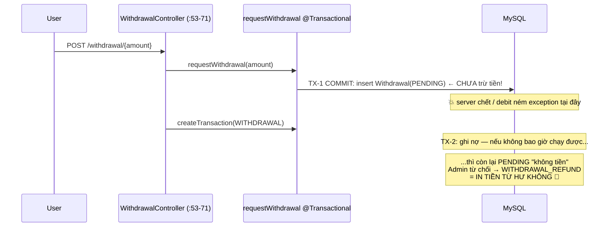

# 03 — PLAN P1: Đúng đắn dưới race & luồng tiền biên

> Giả định P0 đã xong. Mỗi fix vẫn theo cấu trúc: 🔴 → 🔬 → 🛠️ → 🧪 → ✅.

---

## §1 · FIX-P1-5 — Cấm settle đơn CANCELLED

### 🔴 / 🔬
`OrderServiceImpl.java:197-200` chỉ chặn đúng một trạng thái:

```java
if (order.getOrderStatus() == OrderStatus.SUCCESS) {
    return;   // idempotent — nhưng CANCELLED thì rơi xuyên qua!
}
```

Đơn đã hủy vẫn settle được → (trước FIX-P0-1) ai cũng gọi được, (sau P0-1) chính 2 bên vẫn gọi
được một đơn đã hủy → tiền/credit vẫn chuyển. Đây là lỗi **check-then-act sai danh sách trạng thái**
(bài học L2, L7).

### 🛠️ Sửa — whitelist thay vì blacklist, kiểm TRONG lock:

```java
// đang giữ khóa FOR UPDATE trên order row rồi:
if (order.getOrderStatus() != OrderStatus.PENDING) {
    log.info("Order {} not settleable, status={}", orderId, order.getOrderStatus());
    if (order.getOrderStatus() == OrderStatus.SUCCESS) {
        return;                                  // replay → no-op idempotent (giữ nguyên hành vi)
    }
    throw new AppException(ErrorCode.ORDER_NOT_PENDING);   // thêm ErrorCode nếu chưa có
}
```

### 🧪 Test (`OrderCompletionStateTest`)
1. `complete_cancelledOrder_throwsOrderNotPending` và **không có** ledger row nào sinh ra.
2. `complete_pendingOrder_succeeds` (regression).
3. `complete_twice_secondIsNoop` (idempotency giữ nguyên).

### ✅ Nghiệm thu
Hai test đầu xanh; IT concurrency cũ vẫn xanh.

---

## §2 · FIX-P1-6 — Rút tiền: yêu cầu + ghi nợ trong MỘT transaction

### 🔴 / 🔬
Hiện tại tách 2 transaction ở 2 tầng khác nhau:



- `WithdrawalServiceImpl.java:55-84`: tạo PENDING + check balance (chỉ *đọc*), commit.
- `WithdrawalController.java:51-71`: **controller tự gọi ghi nợ** sau đó — ranh giới transaction đặt sai tầng (bài học L5), và giữa 2 tx có cửa sổ chết.

### 🛠️ Sửa

**Bước 1** — dồn toàn bộ vào service, 1 `@Transactional`:

```java
@Transactional
public WithdrawalResponse requestWithdrawal(Long amount) {
    // ... check amount >= 2, load wallet ...
    // BƯỚC GHI NỢ TRƯỚC hoặc ngay cùng lúc với insert — trong CÙNG tx:
    walletTransactionService.createTransaction(WalletTransactionRequest.builder()
            .wallet(wallet)
            .type(WalletTransactionType.WITHDRAWAL)
            .description("Withdrawal request #" + "...")     // gắn linkage withdrawal id
            .amount(withdrawalAmount)                         // giữ quy ước dấu như transferFunds đang dùng
            .build());
    Withdrawal w = withdrawalRepository.save(Withdrawal.builder()
            ... .status(Status.PENDING).build());
    return map(w);
}
```

**Bước 2** — controller chỉ còn gọi service + wrap envelope (xóa dòng 55–71).

**Bước 3** — refund khi REJECTED giữ nguyên (nó đã qua ledger, đúng rồi) — giờ đây refund luôn
có đối trọng là debit đã commit cùng tx với PENDING → bất biến khôi phục:
*PENDING tồn tại ⇔ tiền đã bị giữ.*

**Bước 4 (khuyến nghị nhỏ):** thêm cột `withdrawal_id` (nullable) vào `WalletTransaction`
hoặc chuẩn hóa `description` thành `"WITHDRAWAL:{id}"` để đối soát tìm được cặp debit/refund.

### 🧪 Test (`WithdrawalAtomicityTest`)
1. `requestWithdrawal_createsPendingAndDebitInOneShot` — verify cả 2 tác dụng.
2. `debitFailure_leavesNoPendingRow` — mock `createTransaction` ném exception → repository.save never called.
3. `reject_afterRequest_refundsExactlyOnce` (test cũ `WithdrawalProcessReplayTest` vẫn phải xanh).

### ✅ Nghiệm thu
Query README §4a không lệch; không tồn tại PENDING mà thiếu debit tương ứng:

```sql
SELECT w.* FROM withdrawals w
LEFT JOIN wallet_transactions t ON t.description LIKE CONCAT('%#', w.id, '%')
WHERE w.status='PENDING' AND t.id IS NULL;   -- phải rỗng
```

---

## §3 · FIX-P1-7 — VNPay callback: mở public + BẮT BUỘC xác minh HMAC

### 🔴 / 🔬
Return URL của gateway là trình duyệt **của VNPAY** redirect về — không mang JWT nào cả,
nhưng rơi vào `.authenticated()` (`AppConfig.java:80`) → 401 → đơn không bao giờ thành SUCCEEDED.

⚠️ **Không được** "mở cửa" kiểu thô: callback public = ai cũng forge tham số được. Chỉ an toàn khi
xác minh chữ ký `vnp_SecureHash` bằng `vnp_HashSecret` (server-side secret, client không biết).

### 🛠️ Sửa

**Bước 1 — whitelist đúng đường, đứng trước rule chung** (`AppConfig.java`):

```java
.requestMatchers(HttpMethod.GET, "/api/v1/VNpayment/vnpay-payment").permitAll()
.requestMatchers("/api/admin/**").hasAnyRole("ADMIN")
.requestMatchers("/api/**").authenticated()
```

**Bước 2 — trong handler, trước mọi xử lý tiền:** verify HMAC SHA512 theo spec VNPay:

```java
// 1. sort params theo key (loại vnp_SecureHash*, loại null/rỗng)
// 2. hash = HMAC_SHA512(vnp_HashSecret, queryStringEncoded)
// 3. so sánh constant-time với vnp_SecureHash nhận được
if (!vnPayService.verifySignature(allParams)) {
    log.warn("VNPay signature mismatch, txnRef={}", allParams.get("vnp_TxnRef"));
    return redirectFailPage();        // KHÔNG đụng vào PaymentOrder
}
```

**Bước 3 — kiểm số tiền khớp đơn:** `vnp_Amount` (×100 theo spec) phải == số tiền đã lưu trên
`PaymentOrder` lúc tạo (server-side, bài học L6).

**Bước 4 — apply đi qua đường đã khóa:** dùng đúng luồng locked-transition kiểu
`applyVnPayDeposit` (PENDING → SUCCEEDED dưới lock); `updateOrderStatus` sẽ được sửa ở §4 bên dưới.

### 🧪 Test (`VnPayCallbackSecurityTest`)
1. `callback_withTamperedAmount_rejected` (sửa vnp_Amount, chữ ký cũ → fail).
2. `callback_withoutValidSignature_doesNotTouchOrder`.
3. `callback_validSignature_pendingOrder_becomesSucceeded_exactlyOnce` — gọi 2 lần, credit 1 lần.
4. `callback_unauthenticated_butSigned_isAccepted` (đây chính là case gateway thật).

### ✅ Nghiệm thu
Sandbox VNPay: thanh toán xong quay về → wallet cộng đúng 1 lần; log không còn 401.

---

## §4 · FIX-P1-8 — `updateOrderStatus`: khóa + máy trạng thái

### 🔴 / 🔬
`PaymentServiceImpl.java:350-358` — đọc thường, ghi thường, không `@Transactional`, điều kiện
`if(PENDING)` là check-then-act không lock → đua với `applyVnPayDeposit` (đã khóa) có thể
đè `SUCCEEDED` bằng `FAILED`.

```java
public void updateOrderStatus(String vnp_TxnRef, Status status) {
    PaymentOrder order = paymentOrderRepository.findByVnpTxnRef(vnp_TxnRef)...;
    if(order.getStatus().equals(Status.PENDING)){   // ← đọc không khóa
        order.setStatus(status);                     // ← ghi đè được cả SUCCEEDED
        paymentOrderRepository.save(order);
    }
}
```

### 🛠️ Sửa

**Finder có khóa** (`PaymentOrderRepository`):

```java
@Lock(LockModeType.PESSIMISTIC_WRITE)
@Query("select p from PaymentOrder p where p.vnpTxnRef = :ref")
Optional<PaymentOrder> findByVnpTxnRefForUpdate(@Param("ref") String ref);
```

*(nhớ khai báo `@Param` từ `org.springframework.data.repository.query` — file này từng import nhầm của Lettuce, xem DEBT-5).*

**Máy trạng thái tường minh** (bài học L7):

| Từ ↓ \ Đến → | PENDING | SUCCEEDED | FAILED |
|---|---|---|---|
| PENDING | ✔ | ✔ | ✔ |
| SUCCEEDED | ✖ | — | ✖ (bị chặn — đây là chỗ vá race) |
| FAILED | ✖ | ✔ (cho retry hợp lệ nếu nghiệp vụ cho phép) | — |

```java
@Transactional
public void updateOrderStatus(String ref, Status target) {
    paymentOrderRepository.findByVnpTxnRefForUpdate(ref).ifPresentOrElse(order -> {
        Status current = order.getStatus();
        if (!isTransitionAllowed(current, target)) {
            log.warn("Rejected transition {} -> {} for {}", current, target, ref);
            return;                                   // hoặc throw, tùy ngữ cảnh
        }
        order.setStatus(target);
    }, () -> { throw new ResourceNotFoundException(ref); });
}
```

### 🧪 Test (`PaymentStatusTransitionTest`)
1. `succeeded_cannotBecomeFailed_viaUpdateOrderStatus`
2. `pending_toFailed_allowed`
3. Concurrent: `applyVnPayDeposit` thắng → `updateOrderStatus(FAILED)` bị từ chối (dùng IT nhẹ hoặc awaitility).

---

## §5 · FIX-P1-9 — Credit balance đi qua ledger, bỏ `.max(ZERO)` (effort L)

### 🔴 / 🔬
`OrderServiceImpl.java:309-321` cập nhật `carbon_credit_balance` trực tiếp trên ví **không khóa ví**
(settle khóa ví tiền nhưng phần credit thì set thẳng), và seller decrement kèm `.max(BigDecimal.ZERO)`
— clamp âm thầm biến mất dữ kiện thiếu hụt (bài học L12). Issuance cũng vậy
(`CreditIssuanceServiceImpl.java:167,419`). Vi phạm tuyên bố cốt lõi của chính README: *"no balance
changes without an immutable ledger row"*.

### 🛠️ Sửa
1. Thêm 2 loại giao dịch: `TRADE_CREDIT_OUT` (seller −qty) / `TRADE_CREDIT_IN` (buyer +qty) —
   ghi vào ledger với `balance_before/after` tính trên **carbon_credit_balance**.
2. Trong settlement, ví seller & buyer đã được khóa theo id tăng dần — dùng chính các instance
   đã khóa đó để ghi credit (không load lại entity khác).
3. Xóa `.max(ZERO)`; nếu `currentSellerCredit < qty` → throw (lỗi bất biến dữ liệu, phải thấy rõ),
   vì trước đó listing đã khóa nên về lý thuyết không xảy ra — nếu xảy ra là drift cần điều tra.
4. Issuance chuyển sang `createTransaction(ISSUE_CREDIT)` như cash-side đã làm.

### 🧪 Test
1. `settlement_writesCreditLedgerRows_forBothSides`
2. `creditLedgerChain_continuous_perWallet` (before[i+1] == after[i])
3. `sellerCreditDrift_detected_loudly_notClamped`

### ✅ Nghiệm thu
Bật query đối soát README §4(c) — rỗng.

---

## §6 · FIX-P1-10 — Trạng thái phân phối lợi nhuận phản ánh thất bại riêng phần

### 🔴 / 🔬
`ProfitSharingServiceImpl.java:431-439` nuốt exception từng owner thành `ProfitDistributionDetail(FAILED)`
(thiết kế này ĐÚNG — không rollback các người đã trả), nhưng tổng thể `ProfitDistribution`
vẫn bị đánh dấu COMPLETED → dashboard/report nói dối.

### 🛠️ Sửa — tổng hợp trạng thái sau vòng lặp:

```java
boolean anyFailed = details.stream().anyMatch(d -> d.getStatus() == Status.FAILED);
boolean allFailed = details.stream().allMatch(d -> d.getStatus() == Status.FAILED);
dist.setStatus(allFailed ? ProfitDistributionStatus.FAILED
              : anyFailed ? ProfitDistributionStatus.PARTIAL      // thêm enum value
              : ProfitDistributionStatus.COMPLETED);
```

### 🧪 Test
`payout_twoOwnersOneFails_distributionMarkedPartial_andPaidOwnerStaysPaid`.

---

## §7 · FIX-P1-11 — Tỷ giá ra config, một chiều rounding duy nhất

### 🔴 / 🔬
`CurrencyConverter.java:8` hardcode `26000`; USD→VND làm tròn `HALF_DOWN` (:17) nhưng chiều
ngược lại ở `PaymentServiceImpl.java:207` dùng `HALF_UP` → mỗi lần đổi chiều mất vài đồng,
cộng dồn thành drift khó giải trình. Tỷ giá thật cũng đã lệch xa 26.000.

### 🛠️ Sửa
1. `app.fx.usd-vnd=26000` vào properties (default), inject qua `@Value`/`@ConfigurationProperties`
   — giữ constructor util hoặc chuyển thành bean `FxRateService` (sạch hơn cho test).
2. Chọn **một** rounding: `HALF_UP` cả hai chiều; viết test khóa hành vi.
3. Ghi chú ADR ngắn: khi nào lấy rate động (Stripe đã có conversion — cân nhắc dùng số liệu provider làm source of truth thay vì tự nhân).

### 🧪 Test
`usdToVnd_usesConfiguredRate_halfUp` + `roundTrip_driftAtMostOneUnit`.

---

## §8 · FIX-P1-12 — Frontend correctness pack

### (a) RoleRoute dùng nhầm biến — `RoleRoute.jsx`
```js
const roles = Array.isArray(role) ? role : [role];
const hasPermission = roles.some((r) => allowedRoles.includes(r));  // dòng 11: ĐÚNG
...
if (!allowedRoles.includes(role)) ...                               // dòng 17: SAI — role có thể là mảng
```
→ Sửa dòng 17 thành `if (!hasPermission) return <Navigate to="/unauthorized" replace />;`
và xóa `console.log` dòng 8. *(Lưu ý: guard này chỉ là UX — backend mới là ranh giới thật, bài học L8.)*

### (b) Success-check substring — `apiFetch.js:165-173`
```js
const successValues = ["00000000", "SUCCESS"];                       // bỏ "200","201","OK"
const isSuccess = !data?.responseStatus
  || successValues.some(v => code === v || message === v);           // === chứ không includes
```
Nếu backend có mã số khác ngoài `00000000`, liệt kê **exact-match** đầy đủ (tra `StatusCode` enum).

### (c) LoginAdmin luôn nhớ token — `LoginAdmin.jsx:85`
`remember=true` cứng → JWT admin vào localStorage. Sửa thành `remember=false` mặc định
(admin đăng nhập máy chung là kịch bản thực tế).

### 🧪 Kiểm chứng
- Login user 2 vai trò → không bị đá `/unauthorized`.
- Backend trả business-error code `12003...` → FE hiện toast lỗi (không hiểu nhầm thành công).

---

## Thứ tự gợi ý sprint P1

| # | Việc | Phụ thuộc |
|---|---|---|
| 1 | FIX-P1-5 (nhanh, 15 phút) | P0-1 |
| 2 | FIX-P1-8 + P1-7 (cặp VNPay) | — |
| 3 | FIX-P1-6 (rút tiền atomic) | — |
| 4 | FIX-P1-12 (FE pack) | — |
| 5 | FIX-P1-9 (credit ledger — nặng nhất) | P0-2 (đã có platform-wallet pattern) |
| 6 | FIX-P1-10, P1-11 | — |
