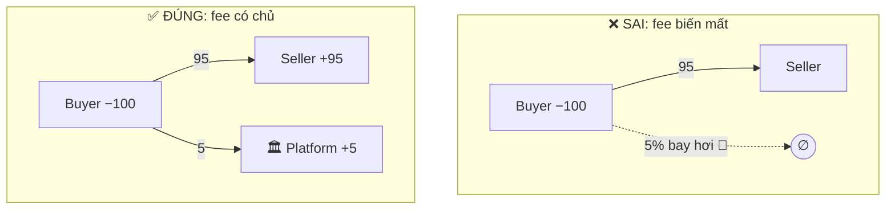
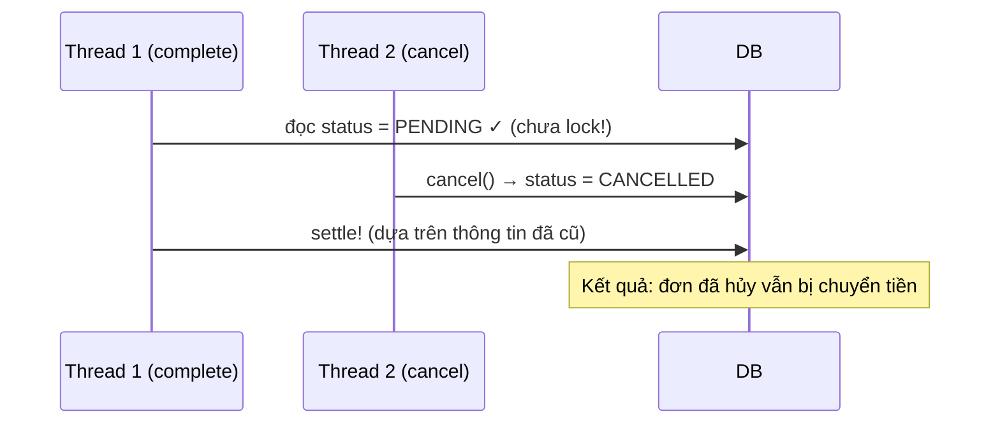
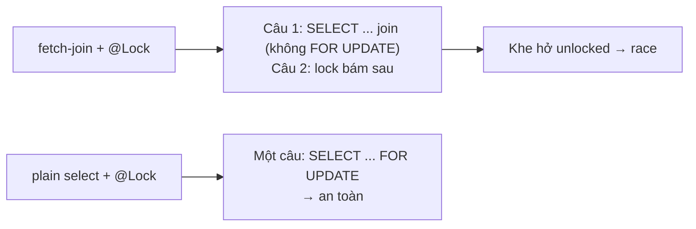
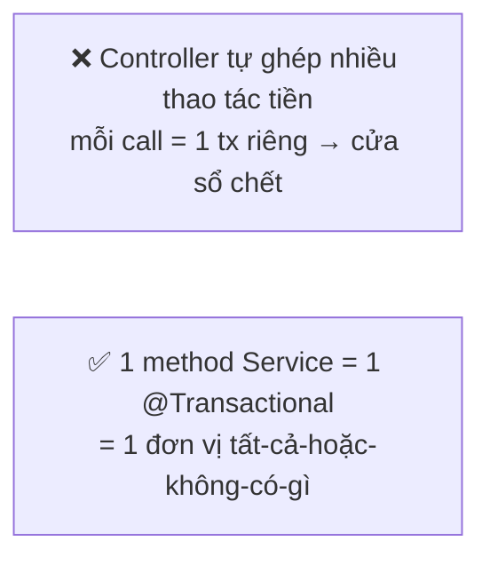
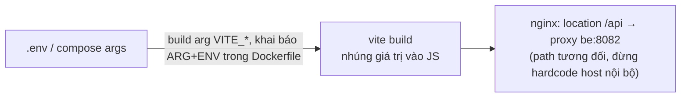

# 05 — BÀI HỌC (Lessons Learned): hiểu lỗi để không mắc lại

> Mỗi bài học: 💡 hiện tượng trong dự án này → 🔬 cơ chế (diagram) → ✅ quy tắc mang đi → 🎣 dấu hiệu phát hiện sớm.
> Đọc kèm khi code theo `02`/`03` — mỗi FIX có ghi bài học liên quan.

---

## L1 · Bảo toàn tiền: mọi đồng ra khỏi ví phải xuất hiện ở ví khác 🏦

**💡 Trong dự án:** phí 5% được *tính và lưu* (`platformFee`) nhưng không ai *nhận* nó
(FIX-P0-2). Nếu sửa vội "seller nhận ít đi" mà không tạo nơi nhận fee, tổng tiền hệ thống
tự nhiên **hụt 5% mỗi giao dịch** mà không ai nhận — kế toán gọi là unexplained loss.



**✅ Quy tắc:** sau MỐI giao dịch, `SUM(amount)` trên toàn ledger phải ≈ 0. Đóng gói thành unit test.
**🎣 Dấu hiệu:** có cột/field "fee", "commission", "discount"... được tính nhưng không thấy đối tác
ghi sổ tương ứng; hoặc query tổng ledger không gần 0.

---

## L2 · Check-then-act phải nằm TRONG lock cùng chỗ quyết định 🔒

**💡 Trong dự án:** đơn CANCELLED vẫn settle được vì code chỉ chặn `SUCCESS`
(FIX-P1-5); `updateOrderStatus` đọc `PENDING?` rồi mới ghi — giữa hai bước thread khác chen ngang
(FIX-P1-8).



**✅ Quy tắc:** kiểm tra điều kiện nghiệp vụ **ngay dưới khóa hàng** (`FOR UPDATE`) và dùng
**whitelist trạng thái** (`!= PENDING → throw`) thay vì blacklist từng case.
**🎣 Dấu hiệu:** `if (entity.getStatus() == ...)` đứng ở dòng đầu method mà dòng tiếp theo mới là
repository finder có `@Lock`.

---

## L3 · Bẫy follow-on locking của Hibernate 🐣

**💡 Trong dự án:** `@Lock(PESSIMISTIC_WRITE)` + `join fetch` trông rất đúng, nhưng Hibernate
KHÔNG ghép được `FOR UPDATE` vào câu có fetch-join → sinh 2 câu: SELECT thường (không khóa)
rồi khóa riêng sau đó. Hai thread cùng đọc PENDING trong cửa sổ unlocked → **settle đôi,
trừ tiền đôi**. Team đã sửa bằng finder plain-select và giữ bản cũ làm dead-code + test cảnh báo.



**✅ Quy tắc:** cần khóa thì finder phải plain (không fetch-join); graph nạp LAZY *sau* khi đã khóa.
**🎣 Dấu hiệu:** query có cả `join fetch` lẫn `@Lock`; hoặc log SQL thấy SELECT rồi một câu
`SELECT ... FOR UPDATE` khác cùng entity.

---

## L4 · Entity cache của Hibernate có thể "đá" lại dữ liệu cũ 👻

**💡 Trong dự án:** load wallet thường → rồi `find(Wallet, id, PESSIMISTIC_WRITE)` → khóa đúng row
NHƯNG trả về instance đã nằm trong persistence context (bản cũ). Hai thread cùng thấy balance=200,
cùng viết balanceAfter → lost update kinh điển. Fix chuẩn: **project id trước**, để lần đầu tiên
entity được chạm trong tx chính là lúc có khóa:

```java
List<Long> ids = repo.findWalletIds(...);                 // chỉ id — không cache entity
ids.sort(Comparator.naturalOrder());                      // khóa theo thứ tự tăng dần (chống deadlock)
Wallet w = em.find(Wallet.class, id, LockModeType.PESSIMISTIC_WRITE); // first touch = locked read
```

**✅ Quy tắc:** "first touch of an entity in a transaction must be the locking read".
**🎣 Dấu hiệu:** load entity bằng finder thường trước, sau đó find-lại-with-lock mong đợi giá mới.

---

## L5 · Ranh giới transaction nằm ở Service, không phải Controller 🧱

**💡 Trong dự án:** rút tiền tách 2 tx — service tạo PENDING commit xong, controller mới ghi nợ
(FIX-P1-6). Giữa 2 tx có cửa sổ chết → PENDING không tiền → refund tạo tiền từ hư không.
Ngược lại, team làm ĐÚNG ở 2 chỗ đáng học: deposit tách chủ đích assert/apply với lý do rõ ràng,
và `REQUIRES_NEW` gọi qua proxy riêng (`getSelf()`, `OrderStatusRecorder`) — tránh bẫy
self-invocation của Spring AOP.



**✅ Quy tắc:** mọi chuỗi thao tác tiền = 1 method service duy nhất có `@Transactional`;
controller chỉ wrap envelope. Cần tx con độc lập → bean riêng + `REQUIRES_NEW`.
**🎣 Dấu hiệu:** controller dài hơn ~10 dòng logic; service gọi nhau qua `this.` mong có tx mới.

---

## L6 · Không bao giờ tin client / gateway callback chưa ký 🚪

**💡 Trong dự án:**
- Stripe/PayPal: backend tự hỏi provider "đơn này đã trả thật chưa?" trước khi cộng tiền — ĐÚNG.
- VNPay: callback đang bị JWT chặn (FIX-P1-7), và khi mở public thì PHẢI verify HMAC
  `vnp_SecureHash` + so khớp `vnp_Amount` với số đã lưu server-side — nếu không, ai cũng
  tự ký được "tôi đã trả 1 triệu".
- Frontend từng gửi `payment_id` — backend đã bỏ tin trường này (comment P0-B/B1) — tốt.

**✅ Quy tắc:** dữ liệu quyết định tiền phải đến từ nguồn server-side (provider API, chữ ký HMAC,
row DB do mình tạo). Tham số từ URL/body chỉ là *yêu cầu*, không phải *sự thật*.
**🎣 Dấu hiệu:** handler cộng tiền mà tham số đầu vào chứa amount/status do client gửi.

---

## L7 · Idempotency + máy trạng thái: mỗi bước chuyển chỉ xảy ra một lần 🔁

**💡 Trong dự án:** deposit apply và withdrawal process đã làm đúng (lock + only-from-PENDING);
settlement thiếu whitelist trạng thái (L2). Mạng lưới hợp lệ nên vẽ thành bảng:

| Từ \ Đến | PENDING | SUCCESS | FAILED | CANCELLED |
|---|---|---|---|---|
| **PENDING** | — | ✔ | ✔ | ✔ |
| **SUCCESS** | ✖ | — | ✖ | ✖ |
| **FAILED/CANCELLED** | ✖ | ✖ | — | — |

**✅ Quy tắc:** transition ngoài bảng → từ chối (log warn). Replay cùng request → no-op an toàn,
không double-effect. Viết replay-test cho mọi endpoint đổi trạng thái tiền.
**🎣 Dấu hiệu:** admin double-click tạo 2 kết quả; F5 trang success cộng tiền lần nữa.

---

## L8 · Authorization phía client chỉ là UX 🎭

**💡 Trong dự án:** `RoleRoute.jsx` chặn route theo role lưu trong localStorage — user chỉ cần sửa
payload là qua. Điều đó KHÔNG sao, miễn backend enforce từng endpoint (P0a authz tests đã có).
Vấn đề thật là khi backend thiếu check như `POST /orders/{id}/complete` (FIX-P0-1).

**✅ Quy tắc:** client guard = trải nghiệm; bảo mật thật = `@PreAuthorize` + ownership check ở
service cho **từng** endpoint chạm dữ liệu người khác. Test matrix role × endpoint × ownership.
**🎣 Dấu hiệu:** controller có endpoint public data của "ai đó" nhưng tham số duy nhất là id.

---

## L9 · Env build-time ≠ env runtime; prefix sai là mất biến 📦

**💡 Trong dự án:** compose truyền `REACT_APP_API_BASE_URL` cho app Vite — Vite chỉ expose biến
`VITE_*` vào `import.meta.env` **lúc build**, không phải runtime. Kết quả: `undefined` trong ảnh Docker
+ nginx không có proxy `/api` (FIX-P0-3).



**✅ Quy tắc:** URL API cho SPA nên là path tương đối (`/api`) + proxy same-origin;
biến build phải khai báo `ARG` → `ENV` trong Dockerfile; fallback defensive trong code
(`|| "/api"`).
**🎣 Dấu hiệu:** bundle chứa chuỗi host nội bộ (`http://be:8082`); env đặt trong compose
`environment:` nhưng app không thấy.

---

## L10 · Secrets & credentials demo là hai việc, đều phải xoay 🗝️

**💡 Trong dự án:** code đã tách secrets ra `.env` + prod refuse-to-start thiếu JWT_SECRET (tốt);
nhưng README vẫn đăng mật khẩu admin của domain **live**. Fix code ≠ remediation:
key/password đã lộ phải **xoay trên server** (xem HARD-6 + checklist rotation sẵn có).

**✅ Quy tắc:** credential từng xuất hiện ở nơi công khai coi như đã lộ — đổi ngay, kể cả demo.
Không publish mật khẩu kèm domain thật; tài khoản demo cấp phát riêng.
**🎣 Dấu hiệu:** grep README/docs thấy chuỗi dạng mật khẩu; `.env.example` chứa giá trị thật.

---

## L11 · Ledger append-only với before/after là "camera giám sát" 🧾

**💡 Trong dự án:** thiết kế `balance_before/balance_after` trên từng row là thứ giúp phát hiện
TẤT CẢ các lỗi L1/L4/L5 chỉ bằng vài query (README §3 giải thích vì sao redundancy là điểm mạnh).
Điều kiện duy nhất: **mọi** thay đổi số dư phải đi qua đúng 2 cổng
(`createTransaction` / `transferFunds`) — phần credit (`carbon_credit_balance`) đang chưa qua cổng
này (FIX-P1-9).

**✅ Quy tắc:** thêm loại số dư mới (credit, điểm...) → phải thêm ledger tương ứng NGAY TỪ ĐẦU,
không "để sau". Chain `after[i] == before[i+1]` per-wallet là bất biến cần test.
**🎣 Dấu hiệu:** field số dư được `setBalance`/`setXxxBalance` ngoài 2 cổng cho phép.

---

## L12 · Clamp `.max(ZERO)` che lỗi thay vì lộ lỗi 🧯

**💡 Trong dự án:** trừ credit seller kèm `.max(BigDecimal.ZERO)` — nếu dữ liệu lệch, hệ thống
im lặng chấp nhận âm→0, drift tích tụ mãi không ai biết (FIX-P1-9).

**✅ Quy tắc:** với **bất biến tài chính**, fail-loud (throw + log + alert) thắng fail-silent.
Clamp chỉ hợp lệ cho hiển thị/UI, không hợp lệ cho phép toán ghi sổ.
**🎣 Dấu hiệu:** `.max(ZERO)`, `.orElse(0)`, catch-and-ignore quanh phép tính tiền.

---

## Tổng kết 1 trang — mang theo khi code

| # | Một câu |
|---|---|
| L1 | Tiền không tự biến mất: mỗi debit phải có credit đối trọng |
| L2 | Kiểm tra trạng thái ngay dưới lock, dùng whitelist |
| L3 | Khóa = plain SELECT ... FOR UPDATE, không fetch-join |
| L4 | Chạm entity lần đầu trong tx = chính là lần đọc có khóa |
| L5 | Chuỗi thao tác tiền = 1 @Transactional ở Service |
| L6 | Amount/status từ client hay callback chỉ là yêu cầu — verify bằng bí mật server-side |
| L7 | Vẽ máy trạng thái; replay = no-op, không double-effect |
| L8 | Client-side role chỉ là UX; backend mới là chốt chặn |
| L9 | SPA dùng `/api` tương đối + nginx proxy; env build-time phải khai báo ARG |
| L10 | Credential đã công khai = đã lộ = phải xoay |
| L11 | Mọi số dư đi qua ledger cổng duy nhất; chain before/after là camera |
| L12 | Với tiền: fail-loud, đừng clamp im lặng |
